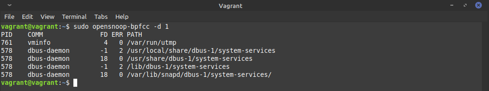

# devops-netology

## 3.3. Операционные системы, лекция 1 - Михаил Караханов

**1. Какой системный вызов делает команда `cd`? ...**
- Ответ: выполнил команду `strace /bin/bash -c 'cd /tmp' 2>&1`. Команда `cd` выполняет системный вызов `chdir()`. Результат: \
`chdir("/tmp")`

**2. Попробуйте использовать команду `file` на объекты разных типов на файловой системе. ... Используя `strace` выясните, где находится база данных `file` на основании которой она делает свои догадки.**
- Ответ: выполнил команду `strace file /dev/sda 2>&1`. Изучив вывод, нашел следующий системный вызов: `openat(AT_FDCWD, "/usr/share/misc/magic.mgc", O_RDONLY) = 3`, открытие файла `magic.mgc`, который является симлинком на файл `/usr/lib/file/magic.mgc`. В данном файле хранится информация по основным типам файлов в операционной системе (на основании их "magic number").

**3. Предположим, приложение пишет лог в текстовый файл. Этот файл оказался удален (deleted в lsof), однако возможности сигналом сказать приложению переоткрыть файлы или просто перезапустить приложение – нет. Так как приложение продолжает писать в удаленный файл, место на диске постепенно заканчивается. Основываясь на знаниях о перенаправлении потоков предложите способ обнуления открытого удаленного файла (чтобы освободить место на файловой системе).**
- Ответ: зная PID приложения, можно с помощью команды `lsof -p <PID>` узнать имя удаленного файла и номер его файлового дескриптора. Далее, можно пустить поток этого файлового дескриптора на вход программе `cat`, а вывод этой команды отправить в `/dev/null` - `cat /proc/<PID>/fd/<descr_number> > /dev/null`.

**4. Занимают ли зомби-процессы какие-то ресурсы в ОС (CPU, RAM, IO)?**
- Ответ: нет, только строчку в таблице процессов.
  
**5. В iovisor BCC есть утилита `opensnoop` ... На какие файлы вы увидели вызовы группы open за первую секунду работы утилиты?**
- Ответ: воспользовался утилитой `opensnoop-bpfcc` c флагом `-d` (duration, время выполнения). Результат: \


**6. Какой системный вызов использует `uname -a`? Приведите цитату из man по этому системному вызову, где описывается альтернативное местоположение в `/proc`, где можно узнать версию ядра и релиз ОС.**
- Ответ: команда `uname -a` совершает системный вызов `uname()`. Информация, получаемая с помощью этой команды, также доступна в каталоге `/proc/sys/kernel`. Цитата из `man 2 uname`: \
```
Part of the utsname information is also accessible via /proc/sys/kernel/{ostype, hostname, osrelease, version, domainname}.
```

**7. Чем отличается последовательность команд через `;` и через `&&` в bash? Есть ли смысл использовать в bash `&&`, если применить `set -e`?**
- Ответ: команды bash, разделенные `;` выполняются последовательно вне зависимости от кода завершения. Конструкция `&&` используется, когда нужно выполнить следующую команду только при завершении предыдущей с кодом выхода `0`. Установка параметра оболочки через `set -e` (прерывать работу сценария оболочки при ненулевом коде выхода команды) не работает в логических конструкциях с `&&` и `||` используемых в сценарии оболочки. Поэтому, использовать `&&` вместе с `set -e` имеет смысл.
  
**8. Из каких опций состоит режим bash `set -euxo pipefail` и почему его хорошо было бы использовать в сценариях?**
- Ответ: указанный режим запуска bash состоит из следующих опций:
  * `-e` \- прерывать работу при ненулевом коде выхода
  * `-u` \- если при подстановке указыватся ссылка на неустановленную переменную, выдавать ошибку
  * `-x` \- при выполнении отображать команды вместе с их аргументами (для трассировки)
  * `-o pipefail` \- устанавливает код завершение конвейера на код завершения последней неудачной команды, или `0`, если все команды в конвейере выполнены успешно

  Данный режим полезен в сценариях, так как позволяет завершить работу сценария при ошибке в одной из команд, тем самым предотвращая необратимые последствия ошибочного исполнения команд.

**9. Используя `-o stat` для `ps`, определите, какой наиболее часто встречающийся статус у процессов в системе. В `man ps` ознакомьтесь (/PROCESS STATE CODES) что значат дополнительные к основной заглавной буквы статуса процессов. Его можно не учитывать при расчете (считать `S`, `Ss` или `Ssl` равнозначными).**