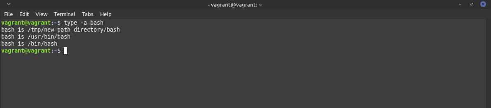

# devops-netology

## 3.1. Работа в терминале, лекция 1 - Михаил Караханов

**8.1 какой переменной можно задать длину журнала `history`, и на какой строчке manual это описывается?**
- Ответ: длина журнала `history` задается переменной `HISTSIZE` в файле `~/.bashrc`. Данный параметр описан
в разделе `Shell Variables` мануала `bash(1)`.

**8.2 что делает директива `ignoreboth` в bash?**
- Ответ: данная директива является одним из значений переменной `HISTCONTROL` bash. Она указывает не сохранять
в журнале `history` повторяющиеся линии и линии, которые начинаются со знака пробела.

**9. В каких сценариях использования применимы скобки `{}` и на какой строчке `man bash` это описано?**
- Ответ: Фигурные скобки используются для развертывания переданного в них масива значений в аргументы или параметры для
команд/функций оболочки. Этот функционал описан в разделе `Brace Expansion` в руководстве `bash(1)`.

**10. С учётом ответа на предыдущий вопрос, как создать однократным вызовом touch 100000 файлов? Получится ли аналогич
ным образом создать 300000? Если нет, то почему?**
- Ответ: создать однократным вызовом `touch` 100000 файлов можно командой `touch file{1..100000}`.
Но 300000 файлов создать таким же образом не получится, т.к. будет превышено ограничение
ОС на максимальный размер переданных аргументов вызываемой программы. Данный размер
регулируется системной переменной `ARG_MAX`. Посмотреть его можно с помощью команды
`getconf ARG_MAX`, измеряется в байтах.

**11. В man bash поищите по `/\[\[`. Что делает конструкция `[[ -d /tmp ]]`?**
- Ответ: данная конструкция проверяет, является ли указанный после флага `d` объект каталогом.
Данное выражение возвращает код выхода `0` или `1`, в зависимости от того, является
ли `/tmp` каталогом или нет. Используется в сценариях оболочки и описана в разделе
`CONDITIONAL EXPRESSIONS` в `bash(1)`.

**12. Основываясь на знаниях о просмотре текущих (например, PATH) и установке
новых переменных; командах, которые мы рассматривали, добейтесь в выводе `type
-a bash` в виртуальной машине наличия первым пунктом в списке...прочие строки
могут отличаться содержимым и порядком) В качестве ответа приведите команды,
которые позволили вам добиться указанного вывода или соответствующие скриншоты.**
- Создал каталог командой `mkdir -p /tmp/new_path_directory`
- Создал символическую ссылку на `bash` в этом каталоге командой `ln -s /usr/bin/bash
/tmp/new_path_directory/bash`
- Добавил созданный каталог в переменную `PATH` в начало списка командой
`PATH="/tmp/new_path_directory:$PATH"`
- Вывод команды `type -a bash`:

**13. Чем отличается планирование команд с помощью `batch` и `at`?**
- Ответ: `at` запускает команду/сценарий в указанное при планировании время, тогда как
`batch` запускает выполнение команд/сценариев только тогда, когда это позволяет текущий
уровень нагрузки на систему ( когда average load падает меньше 1.5).