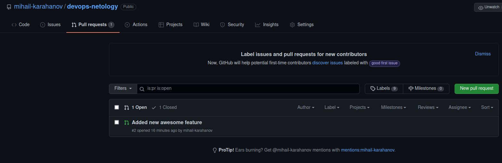

# Домашнее задание к занятию "4.2. Использование Python для решения типовых DevOps задач" - Михаил Караханов

## Обязательная задача 1

Есть скрипт:
```python
#!/usr/bin/env python3
a = 1
b = '2'
c = a + b
```

### Вопросы:
| Вопрос  | Ответ |
| ------------- | ------------- |
| Какое значение будет присвоено переменной `c`?  | Операция завершится ошибкой.  |
| Как получить для переменной `c` значение 12?  | Выполнить `c = str(a) + b` |
| Как получить для переменной `c` значение 3?  | Выполнить `c = a + int(b)` |

## Обязательная задача 2
Мы устроились на работу в компанию, где раньше уже был DevOps Engineer. Он написал скрипт, позволяющий узнать, какие файлы модифицированы в репозитории, относительно локальных изменений. Этим скриптом недовольно начальство, потому что в его выводе есть не все изменённые файлы, а также непонятен полный путь к директории, где они находятся. Как можно доработать скрипт ниже, чтобы он исполнял требования вашего руководителя?

```python
#!/usr/bin/env python3

import os

bash_command = ["cd ~/netology/sysadm-homeworks", "git status"]
result_os = os.popen(' && '.join(bash_command)).read()
is_change = False
for result in result_os.split('\n'):
    if result.find('modified') != -1:
        prepare_result = result.replace('\tmodified:   ', '')
        print(prepare_result)
        break
```

### Ваш скрипт:
```python
#!/usr/bin/env python3

import os

bash_command = ["cd ~/netology/sysadm-homeworks", "git status", "pwd"]
result_os = os.popen(' && '.join(bash_command)).read()
work_dir = result_os.rstrip("\n").split("\n")[-1]
is_change = False
for result in result_os.split('\n'):
    if result.find('modified') != -1:
        prepare_result = result.replace('\tmodified:   ', '')
        print(f"{work_dir}/{prepare_result}")
```

### Вывод скрипта при запуске при тестировании:
```
netadmin@netstation:~/PycharmProjects/devops-netology$ ./1.py 
/home/netadmin/netology/sysadm-homeworks/first_file
/home/netadmin/netology/sysadm-homeworks/second_file
netadmin@netstation:~/PycharmProjects/devops-netology$
```

## Обязательная задача 3
1. Доработать скрипт выше так, чтобы он мог проверять не только локальный репозиторий в текущей директории, а также умел воспринимать путь к репозиторию, который мы передаём как входной параметр. Мы точно знаем, что начальство коварное и будет проверять работу этого скрипта в директориях, которые не являются локальными репозиториями.

### Ваш скрипт:
```python
#!/usr/bin/env python3

import os
from sys import argv

bash_command = [f"cd {argv[1]}", "git status", "pwd"]
result_os = os.popen(' && '.join(bash_command)).read()
work_dir = result_os.rstrip("\n").split("\n")[-1]
# is_change = False - не используется
for result in result_os.split('\n'):
    if result.find('modified') != -1:
        prepare_result = result.replace('\tmodified:   ', '')
        print(f"{work_dir}/{prepare_result}")
```

### Вывод скрипта при запуске при тестировании:
```
netadmin@netstation:~/PycharmProjects/devops-netology$ ./1.py ~/netology/sysadm-homeworks
/home/netadmin/netology/sysadm-homeworks/first_file
/home/netadmin/netology/sysadm-homeworks/second_file
netadmin@netstation:~/PycharmProjects/devops-netology$ 
```

## Обязательная задача 4
1. Наша команда разрабатывает несколько веб-сервисов, доступных по http. Мы точно знаем, что на их стенде нет никакой балансировки, кластеризации, за DNS прячется конкретный IP сервера, где установлен сервис. Проблема в том, что отдел, занимающийся нашей инфраструктурой очень часто меняет нам сервера, поэтому IP меняются примерно раз в неделю, при этом сервисы сохраняют за собой DNS имена. Это бы совсем никого не беспокоило, если бы несколько раз сервера не уезжали в такой сегмент сети нашей компании, который недоступен для разработчиков. Мы хотим написать скрипт, который опрашивает веб-сервисы, получает их IP, выводит информацию в стандартный вывод в виде: <URL сервиса> - <его IP>. Также, должна быть реализована возможность проверки текущего IP сервиса c его IP из предыдущей проверки. Если проверка будет провалена - оповестить об этом в стандартный вывод сообщением: [ERROR] <URL сервиса> IP mismatch: <старый IP> <Новый IP>. Будем считать, что наша разработка реализовала сервисы: `drive.google.com`, `mail.google.com`, `google.com`.

### Ваш скрипт:
```python
#!/usr/bin/env python3

import socket
import time
import os

# Подготовка структуры для хранения значений
services = {
    "drive.google.com": None,
    "mail.google.com": None,
    "google.com": None,
}

while True:
    # Очистка кэша DNS
    os.popen("systemd-resolve --flush-caches")
    # Выполнение опроса для каждого домена
    for serv in services.keys():
        try:
            response = socket.gethostbyname(serv)
            # Проверка полученных значений с предыдущими. Сохранение полученных значений
            if services[serv] == None:
                services[serv] = response
                print(f"{serv} - {response}")
            elif ( services[serv] != None ) and ( services[serv] != response ):
                print(f"[ERROR] {serv} IP mismatch: {services[serv]} {response}")
                services[serv] = response
            else:
                print(f"{serv} - {response}")
            time.sleep(1)
        # Обработка исключений
        except socket.gaierror as err:
            print(f"[ERROR] {serv} - {err}")
```

### Вывод скрипта при запуске при тестировании:
```
netadmin@netstation:~/Repositories/devops-netology$ ./1.py 
drive.google.com - 142.251.31.194
mail.google.com - 173.194.79.18
google.com - 142.250.145.101
drive.google.com - 142.251.31.194
mail.google.com - 173.194.79.18
[ERROR] google.com IP mismatch: 142.250.145.101 142.250.145.102
drive.google.com - 142.251.31.194
[ERROR] mail.google.com IP mismatch: 173.194.79.18 173.194.79.83
[ERROR] google.com IP mismatch: 142.250.145.102 142.250.145.139
drive.google.com - 142.251.31.194
[ERROR] mail.google.com IP mismatch: 173.194.79.83 173.194.79.19
[ERROR] google.com IP mismatch: 142.250.145.139 142.250.145.102
drive.google.com - 142.251.31.194
[ERROR] mail.google.com IP mismatch: 173.194.79.19 173.194.79.17
[ERROR] google.com IP mismatch: 142.250.145.102 142.250.145.101
drive.google.com - 142.251.31.194
mail.google.com - 173.194.79.17
[ERROR] google.com IP mismatch: 142.250.145.101 142.250.145.102
drive.google.com - 142.251.31.194
[ERROR] mail.google.com IP mismatch: 173.194.79.17 173.194.79.19
[ERROR] google.com IP mismatch: 142.250.145.102 142.250.145.101
drive.google.com - 142.251.31.194
[ERROR] mail.google.com IP mismatch: 173.194.79.19 173.194.79.83
google.com - 142.250.145.101
drive.google.com - 142.251.31.194
[ERROR] mail.google.com IP mismatch: 173.194.79.83 173.194.79.19
[ERROR] google.com IP mismatch: 142.250.145.101 142.250.145.113
drive.google.com - 142.251.31.194
```

## Дополнительное задание (со звездочкой*) - необязательно к выполнению

Так получилось, что мы очень часто вносим правки в конфигурацию своей системы прямо на сервере. Но так как вся наша команда разработки держит файлы конфигурации в github и пользуется gitflow, то нам приходится каждый раз переносить архив с нашими изменениями с сервера на наш локальный компьютер, формировать новую ветку, коммитить в неё изменения, создавать pull request (PR) и только после выполнения Merge мы наконец можем официально подтвердить, что новая конфигурация применена. Мы хотим максимально автоматизировать всю цепочку действий. Для этого нам нужно написать скрипт, который будет в директории с локальным репозиторием обращаться по API к github, создавать PR для вливания текущей выбранной ветки в master с сообщением, которое мы вписываем в первый параметр при обращении к py-файлу (сообщение не может быть пустым). При желании, можно добавить к указанному функционалу создание новой ветки, commit и push в неё изменений конфигурации. С директорией локального репозитория можно делать всё, что угодно. Также, принимаем во внимание, что Merge Conflict у нас отсутствуют и их точно не будет при push, как в свою ветку, так и при слиянии в master. Важно получить конечный результат с созданным PR, в котором применяются наши изменения. 

### Ваш скрипт:
```python
#!/usr/bin/env python3

import os
import requests
import subprocess
import json
from sys import argv
from datetime import datetime

PR_MESSAGE = argv[1]
GIT_TOKEN = os.getenv("GIT_TOKEN")
BRANCH_NAME = f"{os.getenv('USER')}_{datetime.now().strftime('%d%m%Y')}"

# Создание отдельной ветки от текущей
with subprocess.Popen(f"git switch -c {BRANCH_NAME}", shell=True, stdout=subprocess.DEVNULL) as proc:
    proc.wait(timeout=3)
    if proc.returncode != 0:
        print("Error! Branch not created!")
    else:
        print(f"Branch {BRANCH_NAME} successfully created!")

# Редактирование файла в новой ветке  
with open("config.txt", "a", encoding="utf-8") as f:
    f.write("This is a new config patch\n")

# Добавление изменений в индекс
with subprocess.Popen("git add .", shell=True, stdout=subprocess.DEVNULL) as proc:
    proc.wait(timeout=3)

# commit и push ветки
with subprocess.Popen(f"git commit -m \"{PR_MESSAGE}\" && git push -u origin {BRANCH_NAME}", \
    shell=True, stdout=subprocess.DEVNULL) as proc:
    proc.wait(timeout=3)
    if proc.returncode != 0:
        print("Error with commit or push!")
    else:
        print("Success!")

# Создание Pull Request в GitHub
custom_headers = {
    "Authorization": f"token {GIT_TOKEN}",
    "Accept": "application/vnd.github.v3+json"
}
payload = {
    "head": BRANCH_NAME,
    "base": "main",
    "title": PR_MESSAGE,
}
response = requests.post("https://api.github.com/repos/mihail-karahanov/devops-netology/pulls", \
    headers=custom_headers, data=json.dumps(payload, indent=4))
print(response.status_code)

```

### Вывод скрипта при запуске при тестировании:
```
netadmin@netstation:~/PycharmProjects/devops-netology$ ./pr_create.py "Added new awesome feature"
Switched to a new branch 'netadmin_26122021'
Branch netadmin_26122021 successfully created!
Enumerating objects: 5, done.
Counting objects: 100% (5/5), done.
Delta compression using up to 4 threads
Compressing objects: 100% (3/3), done.
Writing objects: 100% (4/4), 1.17 KiB | 1.17 MiB/s, done.
Total 4 (delta 1), reused 0 (delta 0), pack-reused 0
remote: Resolving deltas: 100% (1/1), completed with 1 local object.
remote: 
remote: Create a pull request for 'netadmin_26122021' on GitHub by visiting:
remote:      https://github.com/mihail-karahanov/devops-netology/pull/new/netadmin_26122021
remote: 
To github.com:mihail-karahanov/devops-netology.git
 * [new branch]      netadmin_26122021 -> netadmin_26122021
Success!
201
```

Скрин созданного PR в удаленном репозитории: \
