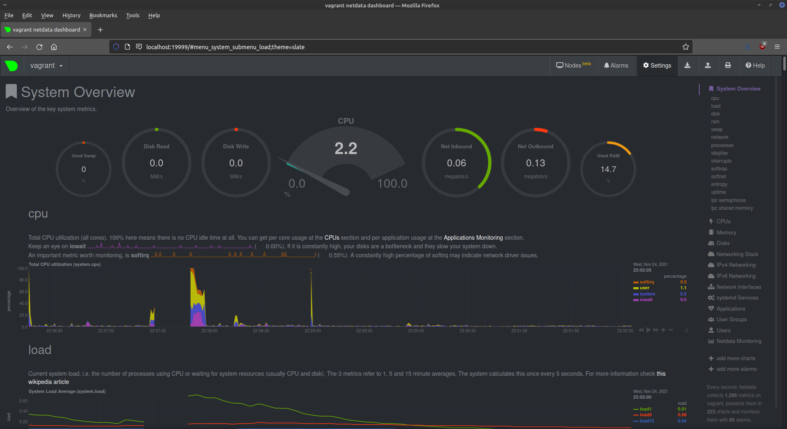
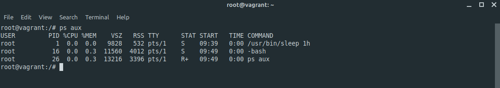

# devops-netology

## 3.4. Операционные системы, лекция 2 - Михаил Караханов

**1. На лекции мы познакомились с `node_exporter`. В демонстрации его исполняемый файл запускался в background. Этого достаточно для демо, но не для настоящей production-системы, где процессы должны находиться под внешним управлением. Используя знания из лекции по systemd, создайте самостоятельно простой unit-файл для `node_exporter`**
- Результат работы:
  - исполняемый файл распакован в директорию `/opt/node-exporter`
  - создан unit-файл `/etc/systemd/system/node-exporter.service`. Содержание файла:
    ```
    # /etc/systemd/system/node-exporter.service
    [Unit]
    Description=Node exporter daemon
    After=network.target

    [Service]
    EnvironmentFile=-/opt/node-exporter/main.conf
    ExecStart=/opt/node-exporter/node_exporter $EXTRA_OPTS
    KillMode=process
    Restart=on-failure

    [Install]
    WantedBy=multi-user.target
    ```
  - В файле `/opt/node-exporter/main.conf` следующее содержание (параметр закомментирован т.к. пока не используется):
    ```
    # Node Exporter Configuration File

    #EXTRA_OPTS=
    ```
  - выполнено подключение и запуск службы командами `sudo systemctl enable node-exporter` и `sudo systemctl start node-exporter`. Далее последовательно выполнены команды stop, start и restart службы. Результат проверки состояния службы:
    

**2. Ознакомьтесь с опциями node_exporter и выводом `/metrics` по-умолчанию. Приведите несколько опций, которые вы бы выбрали для базового мониторинга хоста по CPU, памяти, диску и сети.**
- Для мониторинга CPU можно выбрать следующие метрики:
  - `node_cpu_seconds_total{cpu="0",mode="system"}`
  - `node_cpu_seconds_total{cpu="0",mode="user"}`
  - `node_cpu_seconds_total{cpu="0",mode="idle"}`
  - `node_cpu_seconds_total{cpu="0",mode="iowait"}`
- Для мониторинга памяти можно выбрать следующие метрики:
  - `node_memory_MemTotal_bytes`
  - `node_memory_MemFree_bytes`
  - `node_memory_MemAvailable_bytes`
  - `node_memory_Cached_bytes`
  - `node_memory_SwapTotal_bytes`
  - `node_memory_SwapCached_bytes`
  - `node_memory_SwapFree_bytes`
- Для мониторинга диска можно выбрать следующие метрики:
  - `node_disk_info`
  - `node_disk_io_time_seconds_total`
  - `node_disk_write_time_seconds_total`
  - `node_disk_read_time_seconds_total`
  - `node_filesystem_size_bytes`
- Для мониторинга сети можно выбрать следующие метрики:
  - `node_network_up`
  - `node_network_receive_bytes_total`
  - `node_network_transmit_bytes_total`
  - `node_network_receive_errs_total`
  - `node_network_transmit_errs_total`

**3. Установите в свою виртуальную машину `Netdata`...**
- Пакет установлен. Результат:
  

**4. Можно ли по выводу `dmesg` понять, осознает ли ОС, что загружена не на настоящем оборудовании, а на системе виртуализации?**
- Ответ: да, это можно понять по следующему выводу:
  ```
  vagrant@vagrant:~$ sudo dmesg | grep -i virtual
  [    0.000000] DMI: innotek GmbH VirtualBox/VirtualBox, BIOS VirtualBox 12/01/2006
  [    0.004630] CPU MTRRs all blank - virtualized system.
  [    0.141069] Booting paravirtualized kernel on KVM
  [    3.294573] systemd[1]: Detected virtualization oracle.
  ```
**5. Как настроен sysctl `fs.nr_open` на системе по-умолчанию? Узнайте, что означает этот параметр. Какой другой существующий лимит не позволит достичь такого числа (`ulimit --help`)?**
- Ответ: данный параметр определяет максимальное количество файл-дескрипторов, которые может открыть процесс. Значение по-умолчанию 1024\*1024 (1048576). Проверить установленное значение в системе можно командой `sudo sysctl -a --pattern fs.nr`. Вывод команды:
  ```
  vagrant@vagrant:~$ sudo sysctl -a --pattern fs.nr
  fs.nr_open = 1048576
  ```
  Данный параметр зависит от системного лимита RLIMIT_NOFILE.

**6. Запустите любой долгоживущий процесс (не `ls`, который отработает мгновенно, а, например, `sleep 1h`) в отдельном неймспейсе процессов; покажите, что ваш процесс работает под PID 1 через `nsenter`. Для простоты работайте в данном задании под root (`sudo -i`). Под обычным пользователем требуются дополнительные опции (`--map-root-user`) и т.д.**
- Ответ: запустил `screen`, далее выполнил команду `unshare -f --pid --mount-proc /usr/bin/sleep 1h`. Перевел процесс в `bg`. Получились следующие процессы:
  ```
  root        1411  0.0  0.0   9832   524 pts/1    S    09:39   0:00 unshare -f --pid --mount-proc /usr/bin/sleep 1h
  root        1412  0.0  0.0   9828   532 pts/1    S    09:39   0:00 /usr/bin/sleep 1h
  ```
  Перешел в новый namespace командой `nsenter --target 1412 --pid --mount`. Вывод команды `ps aux`:
  

**7. Найдите информацию о том, что такое `:(){ :|:& };:`. Запустите эту команду в своей виртуальной машине Vagrant с Ubuntu 20.04 (это важно, поведение в других ОС не проверялось). Некоторое время все будет "плохо", после чего (минуты) – ОС должна стабилизироваться. Вызов dmesg расскажет, какой механизм помог автоматической стабилизации. Как настроен этот механизм по-умолчанию, и как изменить число процессов, которое можно создать в сессии?**
- Ответ: данная конструкция - это, так называемая, forkbomb. Данная функция вызывает сама себя в фоне, тем самым очень быстро увеличивая количество системных вызовов fork() поцессов в текущей сессии. Максимальное количество процессов в пользовательской сессиии регулируется системным лимитом `RLIMIT_NPROC`. Изменить пороговое значение можно с помощью `ulimit -u`.