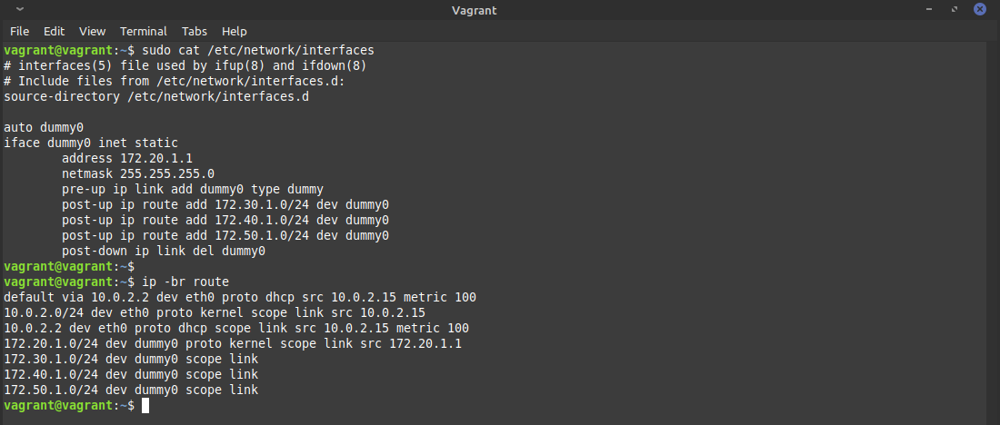
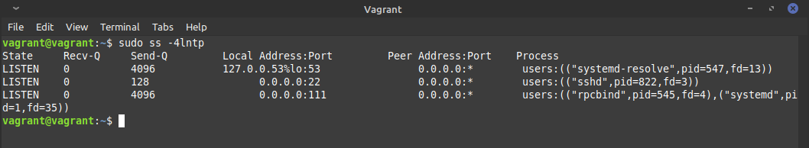
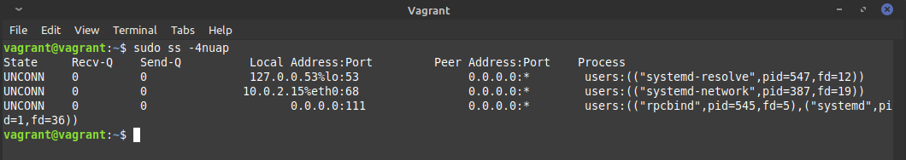
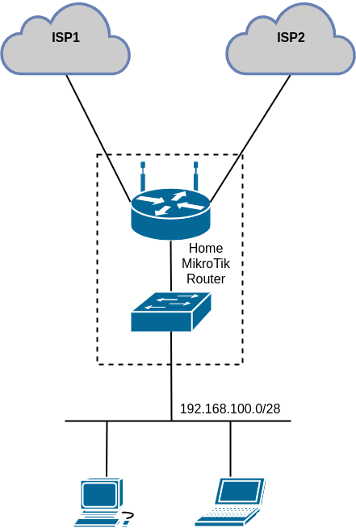

# devops-netology

## 3.8. Компьютерные сети, лекция 3 - Михаил Караханов


**1. Подключитесь к публичному маршрутизатору в интернет. Найдите маршрут к вашему публичному IP**
- Результат:
  ```
  route-views>show ip route 80.78.245.155
  Routing entry for 80.78.245.0/24
    Known via "bgp 6447", distance 20, metric 0
    Tag 6939, type external
    Last update from 64.71.137.241 5d07h ago
    Routing Descriptor Blocks:
    * 64.71.137.241, from 64.71.137.241, 5d07h ago
        Route metric is 0, traffic share count is 1
        AS Hops 3
        Route tag 6939
        MPLS label: none
  route-views>
  route-views>show bgp 80.78.245.155     
  BGP routing table entry for 80.78.245.0/24, version 1388695216
  Paths: (23 available, best #22, table default)
    ------------------------
    6939 39134 197695
      64.71.137.241 from 64.71.137.241 (216.218.252.164)
        Origin IGP, localpref 100, valid, external, best
        path 7FE0DB0D2308 RPKI State valid
        rx pathid: 0, tx pathid: 0x0
    Refresh Epoch 1
    -------------------------

  ```

**2. Создайте dummy0 интерфейс в Ubuntu. Добавьте несколько статических маршрутов. Проверьте таблицу маршрутизации.**
- Результат: подгружен модуль ядра `dummy`, создан интерфейс `dummy0` и добавлены статические маршруты: \
  

**3. Проверьте открытые TCP порты в Ubuntu, какие протоколы и приложения используют эти порты? Приведите несколько примеров.**
- Результат: для проверки TCP-портов в статусе LISTEN, воспользовался командой `ss -4lntp`. Вывод команды: \
  
  - порт 53 - это локальный DNS-резолвер Ubuntu
  - порт 22 - это SSH-сервер
  - порт 111 - `rpcbind`, сервис для обслуживания удаленных вызовов по протоколу RPC

**4. Проверьте используемые UDP сокеты в Ubuntu, какие протоколы и приложения используют эти порты?**
- Результат: для проверки используемых UDP-сокетов воспользовался командой `ss -4nuap`. Вывод команды: \
  
  - порт 53 - это локальный DNS-резолвер Ubuntu
  - порт 68 - это локальный DHCP-клиент
  - порт 111 - `rpcbind`, сервис для обслуживания удаленных вызовов по протоколу RPC

**5. Используя diagrams.net, создайте L3 диаграмму вашей домашней сети или любой другой сети, с которой вы работали.**
- Результат: схема домашней сети \
  
