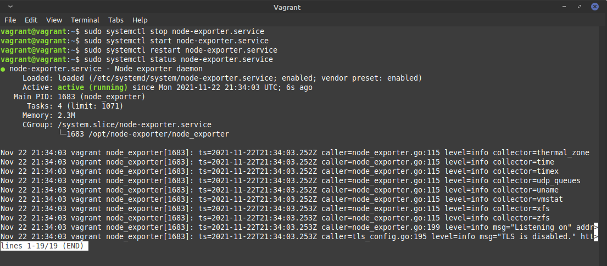

# devops-netology

## 3.4. Операционные системы, лекция 2 - Михаил Караханов

**1. На лекции мы познакомились с `node_exporter`. В демонстрации его исполняемый файл запускался в background. Этого достаточно для демо, но не для настоящей production-системы, где процессы должны находиться под внешним управлением. Используя знания из лекции по systemd, создайте самостоятельно простой unit-файл для `node_exporter`**
- Результат работы:
  - исполняемый файл распакован в директорию `/opt/node-exporter`
  - создан unit-файл `/etc/systemd/system/node-exporter.service`. Содержание файла:
    ```
    # /etc/systemd/system/node-exporter.service
    [Unit]
    Description=Node exporter daemon
    After=network.target

    [Service]
    EnvironmentFile=-/opt/node-exporter/main.conf
    ExecStart=/opt/node-exporter/node_exporter $EXTRA_OPTS
    KillMode=process
    Restart=on-failure

    [Install]
    WantedBy=multi-user.target
    ```
  - выполнено подключение и запуск службы командами `sudo systemctl enable node-exporter` и `sudo systemctl start node-exporter`. Далее последовательно выполнены команды stop, start и restart службы. Результат проверки состояния службы:
    

**2. Ознакомьтесь с опциями node_exporter и выводом `/metrics` по-умолчанию. Приведите несколько опций, которые вы бы выбрали для базового мониторинга хоста по CPU, памяти, диску и сети.**
- Для мониторинга CPU можно выбрать следующие метрики:
  - `node_cpu_seconds_total{cpu="0",mode="system"}`
  - `node_cpu_seconds_total{cpu="0",mode="user"}`
  - `node_cpu_seconds_total{cpu="0",mode="idle"}`
  - `node_cpu_seconds_total{cpu="0",mode="iowait"}`
- Для мониторинга памяти можно выбрать следующие метрики:
  - `node_memory_MemTotal_bytes`
  - `node_memory_MemFree_bytes`
  - `node_memory_MemAvailable_bytes`
  - `node_memory_Cached_bytes`
  - `node_memory_SwapTotal_bytes`
  - `node_memory_SwapCached_bytes`
  - `node_memory_SwapFree_bytes`
- Для мониторинга диска можно выбрать следующие метрики:
  - `node_disk_info`
  - `node_disk_io_time_seconds_total`
  - `node_disk_write_time_seconds_total`
  - `node_disk_read_time_seconds_total`
  - `node_filesystem_size_bytes`
- Для мониторинга сети можно выбрать следующие метрики:
  - `node_network_up`
  - `node_network_receive_bytes_total`
  - `node_network_transmit_bytes_total`
  - `node_network_receive_errs_total`
  - `node_network_transmit_errs_total`

**3. Установите в свою виртуальную машину `Netdata`...**