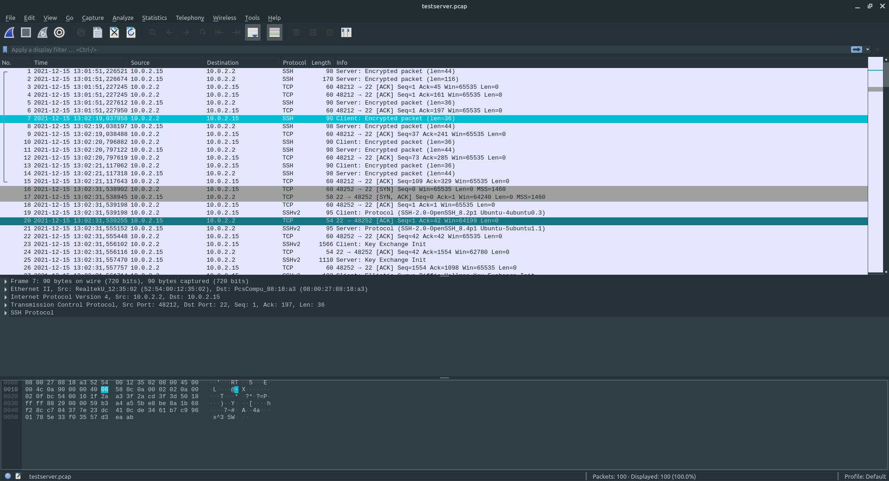

# devops-netology

## 3.9. Элементы безопасности информационных систем - Михаил Караханов


**1. Установите Bitwarden плагин для браузера. Зарегестрируйтесь и сохраните несколько паролей.**
- Результат: выполнено \
  

**2. Установите Google authenticator на мобильный телефон. Настройте вход в Bitwarden акаунт через Google authenticator OTP.**
- Результат: выполнено

**3. Установите apache2, сгенерируйте самоподписанный сертификат, настройте тестовый сайт для работы по HTTPS.**
- Настроил проброс портов в vagrant
  ```
  config.vm.network "forwarded_port", guest: 80, host: 8080
  config.vm.network "forwarded_port", guest: 443, host: 8083
  ```
- Выполнил установку apache командой `sudo apt install apache2`. Включил модуль SSL командой `sudo a2enmod ssl`. Включил модуль mod_headers командой `sudo a2enmod headers`.
- Сгенерировал самоподписанный сертификат
- С помощью ресурса https://ssl-config.mozilla.org/ подготовил конфигурацию веб-сервера:
  ```
  <VirtualHost *:443>
    ServerName dumb.com
    DocumentRoot /var/www/html
    SSLEngine on
    SSLCertificateFile /etc/ssl/certs/apache-selfsigned.crt
    SSLCertificateKeyFile /etc/ssl/private/apache-selfsigned.key
    # enable HTTP/2, if available
    Protocols h2 http/1.1
    # HTTP Strict Transport Security (mod_headers is required) (63072000 seconds)
    Header always set Strict-Transport-Security "max-age=63072000"
  </VirtualHost>

  # intermediate configuration
  SSLProtocol             all -SSLv3 -TLSv1 -TLSv1.1
  SSLCipherSuite          ECDHE-ECDSA-AES128-GCM-SHA256:ECDHE-RSA-AES128-GCM-SHA256:ECDHE-ECDSA-AES256-GCM-SHA384:ECDHE-RSA-AES256-GCM-SHA384:ECDHE-ECDSA-CHACHA20-POLY1305:ECDHE-RSA-CHACHA20-POLY1305:DHE-RSA-AES128-GCM-SHA256:DHE-RSA-AES256-GCM-SHA384
  SSLHonorCipherOrder     off
  SSLSessionTickets       off

  SSLUseStapling On
  SSLStaplingCache "shmcb:logs/ssl_stapling(32768)"
  ```
- Создал простую конфигурацию в файле `/var/www/html/index.html`:
  ```
  <h1>It worked!</h1>
  ```
- Активировал конфигурацию и перезагрузил веб-сервер. С хоста перешел в браузере по ссылке `https://127.0.0.1:8083`. Результат: \
  

**4. Проверьте на TLS уязвимости произвольный сайт в интернете...**
- Выполнил проверку тестового сервера (`https://127.0.0.1:8083`) и сайта `santehnica.ru`. Часть вывода: \
  

**5. Установите на Ubuntu ssh сервер, сгенерируйте новый приватный ключ. Скопируйте свой публичный ключ на другой сервер. Подключитесь к серверу по SSH-ключу.**
- Установил SSH-сервер командой `sudo apt install openssh-server`
- На хосте сгенерировал ssh-ключи командой `ssh-keygen -b 2048 -t rsa -C "test server"`
- Скопировал содержимое публичного ключа на сервер, в файл `~/.ssh/authorized_keys`
- Проверил подключение командой `ssh -i ~/.ssh/test_server admin@127.0.0.1 -p 2001` (сервер запущен в VirtualBox, настроен проброс портов хост 2001 => сервер 22)

**6. Переименуйте файлы ключей из задания 5. Настройте файл конфигурации SSH клиента, так чтобы вход на удаленный сервер осуществлялся по имени сервера.**
- Создал файл конфигурации SSH `~/.ssh/config` для тестового сервера:
  ```
  Host testserver
        HostName 127.0.0.1
        IdentityFile ~/.ssh/test_server
        User admin
        Port 2001
  ```

**7. Соберите дамп трафика утилитой tcpdump в формате pcap, 100 пакетов. Откройте файл pcap в Wireshark.**
- На тестовом сервере сняд дамп командой `sudo tcpdump -i enp0s3 -c 100 -w testserver.pcap`
- Скопировал файл на хост и открыл в Wireshark: \
  