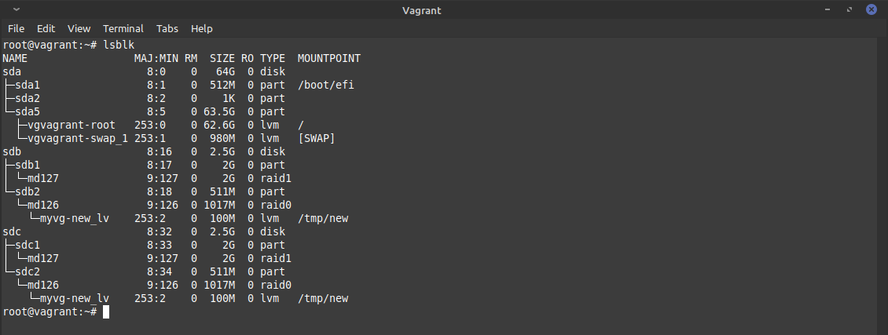
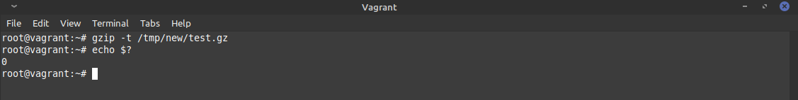
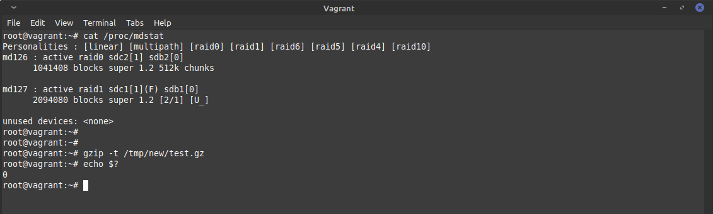

# devops-netology

## 3.5. Файловые системы - Михаил Караханов

**1. Узнайте о sparse (разряженных) файлах.**
- Прочитал статью на вики. Это файлы, при записи которых на диск, последовательности нулевых байтов не записываются на диск, а информация о них записывается в метаданные файловой системы.
  
**2. Могут ли файлы, являющиеся жесткой ссылкой на один объект, иметь разные права доступа и владельца? Почему?**
- Ответ: Hardlink, в отличии от Symlink, имеет один и тот же номер inode, что и исходный файл. Это упоминание одного и того же файла в файловой системе - соответственно, наследуются все права и владельцы данного файла.
  
**3. Сделайте `vagrant destroy` на имеющийся инстанс Ubuntu. Замените содержимое Vagrantfile следующим... Данная конфигурация создаст новую виртуальную машину с двумя дополнительными неразмеченными дисками по 2.5 Гб.**
- Результат: выполнено.
  
**4. Используя `fdisk`, разбейте первый диск на 2 раздела: 2 Гб, оставшееся пространство.**
- Результат: выполнено с помощью мастера после выполнения команды `fdisk /dev/sdb`.
  ```
  Disk /dev/sdb: 2.51 GiB, 2684354560 bytes, 5242880 sectors
  Disk model: VBOX HARDDISK   
  Units: sectors of 1 * 512 = 512 bytes
  Sector size (logical/physical): 512 bytes / 512 bytes
  I/O size (minimum/optimal): 512 bytes / 512 bytes
  Disklabel type: gpt
  Disk identifier: 18A00DD9-077C-9642-937E-30A2D9DDF632

  Device       Start     End Sectors  Size Type
  /dev/sdb1     2048 4196351 4194304    2G Linux filesystem
  /dev/sdb2  4196352 5242846 1046495  511M Linux filesystem
  ```

**5. Используя `sfdisk`, перенесите данную таблицу разделов на второй диск.**
- Результат: выполнена команда `sfdisk -d /dev/sdb | sfdisk /dev/sdc`. Вывод `fdisk -l /dev/sdc`:
  ```
  Disk /dev/sdc: 2.51 GiB, 2684354560 bytes, 5242880 sectors
  Disk model: VBOX HARDDISK   
  Units: sectors of 1 * 512 = 512 bytes
  Sector size (logical/physical): 512 bytes / 512 bytes
  I/O size (minimum/optimal): 512 bytes / 512 bytes
  Disklabel type: gpt
  Disk identifier: 18A00DD9-077C-9642-937E-30A2D9DDF632

  Device       Start     End Sectors  Size Type
  /dev/sdc1     2048 4196351 4194304    2G Linux filesystem
  /dev/sdc2  4196352 5242846 1046495  511M Linux filesystem
  ```

**6. Соберите `mdadm` RAID1 на паре разделов 2 Гб.**
- Результат: создано устройство `/dev/md/lvl1` командой `mdadm --create --verbose /dev/md/lvl1 --level=1 --raid-devices=2 /dev/sdb1 /dev/sdc1`.

**7. Соберите `mdadm` RAID0 на второй паре маленьких разделов.**
- Результат: создано устройство `/dev/md/lvl0` командой `mdadm --create --verbose /dev/md/lvl0 --level=0 --raid-devices=2 /dev/sdb2 /dev/sdc2`. Вывод `cat /proc/mdstat` после создания двух RAID-массивов:
  ```
  root@vagrant:~# cat /proc/mdstat
  Personalities : [linear] [multipath] [raid0] [raid1] [raid6] [raid5] [raid4] [raid10] 
  md126 : active raid0 sdc2[1] sdb2[0]
        1041408 blocks super 1.2 512k chunks
        
  md127 : active raid1 sdc1[1] sdb1[0]
        2094080 blocks super 1.2 [2/2] [UU]
        
  unused devices: <none>
  ```

**8. Создайте 2 независимых PV на получившихся md-устройствах.**
- Результат: выполнены команды `pvcreate /dev/md/lvl0` и `pvcreate /dev/md/lvl1`.

**9. Создайте общую volume-group на этих двух PV.**
- Результат: создана volume group с именем `myvg` командой `vgcreate myvg /dev/md/lvl0 /dev/md/lvl1`.

**10. Создайте LV размером 100 Мб, указав его расположение на PV с RAID0.**
- Результат: создан LV с именем `new_lv` в VG с именем `myvg` на RAID0-массиве командой `lvcreate -L 100M -n new_lv myvg /dev/md/lvl0`.

**11. Создайте `mkfs.ext4` ФС на получившемся LV.**
- Результат: создана файловая система командой `mkfs.ext4 /dev/myvg/new_lv`.

**12. Смонтируйте этот раздел в любую директорию, например, `/tmp/new`.**
- Результат: создан каталог командой `mkdir /tmp/new`. В данный каталог смонтирован новый LV командой `mount /dev/myvg/new_lv /tmp/new`.

**13. Поместите туда тестовый файл, например wget `https://mirror.yandex.ru/ubuntu/ls-lR.gz -O /tmp/new/test.gz`.**
- Результат: выполнено.

**14. Прикрепите вывод `lsblk`.**
- Вывод: \
  

**15. Протестируйте целостность файла:**
- Выполнено, вывод: \
  

**16. Используя pvmove, переместите содержимое PV с RAID0 на RAID1.**
- Результат: выполнено перемещение LV с именем `new_lv` командой `pvmove -n new_lv /dev/md/lvl0 /dev/md/lvl1`.

**17. Сделайте `--fail` на устройство в вашем RAID1 md.**
- Результат: помечен как неисправный один из дисков командой `mdadm --fail /dev/md/lvl1 /dev/sdc1`.
  
**18. Подтвердите выводом `dmesg`, что RAID1 работает в деградированном состоянии.**
- Вывод `dmesg`:
  ```
  [Sun Nov 28 21:54:44 2021] md/raid1:md127: Disk failure on sdc1, disabling device.
                           md/raid1:md127: Operation continuing on 1 devices.
  ```

**19. Протестируйте целостность файла, несмотря на "сбойный" диск он должен продолжать быть доступен:**
- Вывод результата теста: \
  
