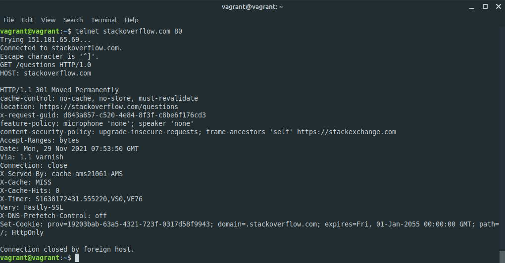
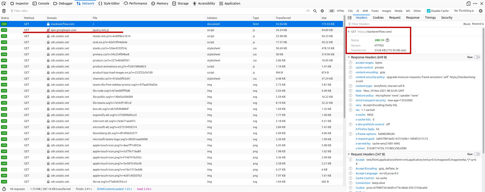
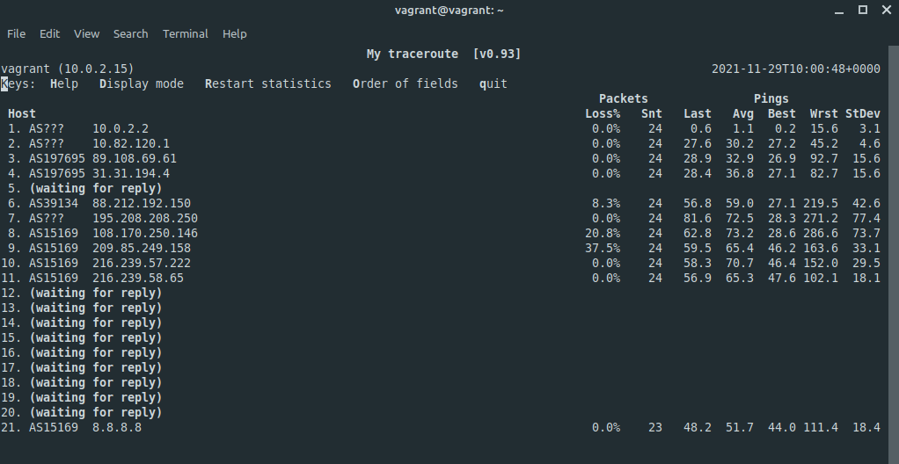

# devops-netology

## 3.6. Компьютерные сети, лекция 1 - Михаил Караханов


**1. Работа c HTTP через телнет...Подключитесь утилитой телнет к сайту stackoverflow.com...В ответе укажите полученный HTTP код, что он означает?**
- Результат: вывод команды `telnet` \
   \
  Получен HTTP код `HTTP/1.1 301 Moved Permanently` и новый URL - `location: https://stackoverflow.com/questions`. Это редирект с порта 80 на порт 443(HTTPS).

**2. Повторите задание 1 в браузере, используя консоль разработчика F12.**
- Результат: \
   \
  Код 301 не удалось поймать, в консоли Firefox сразу виден 200 на https://stackoverflow.com. Дольше всего выполнялась загрузка скриптов (jquery.min.js) c googleapis.com (выделено на скриншоте).

**3. Какой IP адрес у вас в интернете?**
- Ответ: 80.78.245.155 (информация с ресурса whoer.net)

**4. Какому провайдеру принадлежит ваш IP адрес? Какой автономной системе AS? Воспользуйтесь утилитой `whois`**
- Ответ:
  ```
  route:          80.78.245.0/24
  descr:          Reg.Ru
  origin:         AS197695
  mnt-by:         REGRU-MNT
  ```

**5. Через какие сети проходит пакет, отправленный с вашего компьютера на адрес 8.8.8.8? Через какие AS? Воспользуйтесь утилитой `traceroute`**
- Ответ: согласно traceroute, пакет идет по следющему пути - AS197695 => AS39134 => AS5480 => AS15169
  ```
  vagrant@vagrant:~$ traceroute -IAn 8.8.8.8
	traceroute to 8.8.8.8 (8.8.8.8), 30 hops max, 60 byte packets
	1  10.0.2.2 [*]  0.524 ms  0.470 ms  0.440 ms
	2  10.82.120.1 [*]  28.957 ms  55.648 ms  83.067 ms
	3  89.108.69.61 [AS197695/AS43146]  83.042 ms  82.639 ms  82.618 ms
	4  31.31.194.4 [AS197695]  82.604 ms  82.599 ms  82.592 ms
	5  * * *
	6  88.212.192.150 [AS39134]  82.549 ms  52.284 ms  80.046 ms
	7  195.208.208.250 [AS5480]  79.962 ms  81.591 ms  81.523 ms
	8  108.170.250.146 [AS15169]  53.624 ms * *
	9  * * *
	10  216.239.57.222 [AS15169]  107.963 ms  107.936 ms  107.748 ms
	11  216.239.58.65 [AS15169]  80.875 ms  80.849 ms  74.594 ms
	12  * * *
	13  * * *
	14  * * *
	15  * * *
	16  * * *
	17  * * *
	18  * * *
	19  * * *
	20  * * *
	21  8.8.8.8 [AS15169]  71.703 ms  43.599 ms  86.466 ms
	```

**6. Повторите задание 5 в утилите `mtr`. На каком участке наибольшая задержка - delay?**
- Результат: \
	 \
	Наибольшая задержка на участке между узлами с адресами 108.170.250.146 и 209.85.249.158

**7. Какие DNS сервера отвечают за доменное имя `dns.google`? Какие A записи? воспользуйтесь утилитой `dig`**
- Ответ: воспользовался командой `dig +trace dns.google` для получения полной информации по запросу. По информации из трассировки, доменное имя `dns.google` обслуживают следующие сервера:
	```
	dns.google.		10800	IN	NS	ns2.zdns.google.
	dns.google.		10800	IN	NS	ns1.zdns.google.
	dns.google.		10800	IN	NS	ns3.zdns.google.
	dns.google.		10800	IN	NS	ns4.zdns.google.
	```
	А-записи вернул сервер с именем `ns2.zdns.google`:
	```
	dns.google.		900	IN	A	8.8.4.4
	dns.google.		900	IN	A	8.8.8.8
	```

**8. Проверьте PTR записи для IP адресов из задания 7. Какое доменное имя привязано к IP? воспользуйтесь утилитой `dig`**
- Ответ: выполнил команды `dig -x 8.8.8.8` и `dig -x 8.8.4.4`. Результат:
	```
	;; ANSWER SECTION:
	8.8.8.8.in-addr.arpa.	4703	IN	PTR	dns.google.

	;; ANSWER SECTION:
	4.4.8.8.in-addr.arpa.	18422	IN	PTR	dns.google.
	```