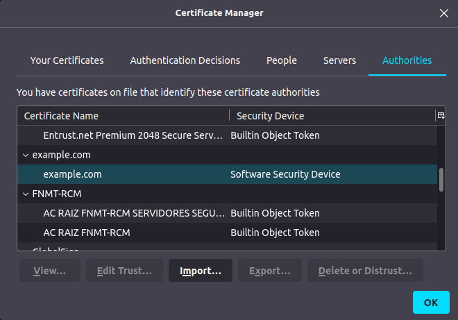
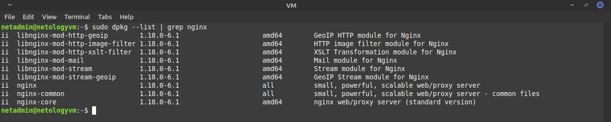
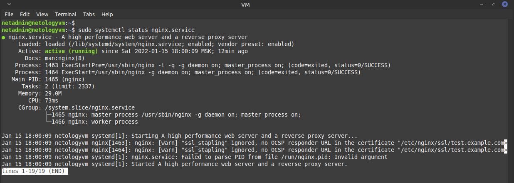
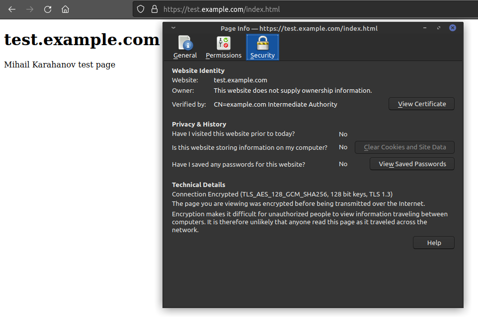
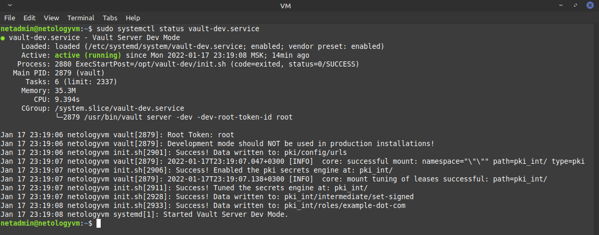

# Курсовая работа по итогам модуля "DevOps и системное администрирование" - Михаил Караханов

## Выполненные работы

1. Создана ВМ `netologyvm` на базе Oracle VirtualBox, установлена OC **Debian 11 (bullseye)**
2. Установка и настройка `ufw`:
    - выполнена установка пакета командой `sudo apt install ufw`
    - ВМ имеет несколько сетевых интерфейсов (lo, NAT и для связности с хостом)

    ```bash
    netadmin@netologyvm:~$ ip -br addr
    lo               UNKNOWN        127.0.0.1/8 ::1/128 
    enp0s3           UP             10.0.2.15/24 fe80::a00:27ff:fe03:386d/64 
    enp0s8           UP             192.168.56.101/24 fe80::a00:27ff:fea8:f000/64 
    ```

    - трафик на интерфейсе lo разрешен правилами, прописанными в файле `/etc/ufw/before.rules`

    ```bash
    # allow all on loopback
    -A ufw-before-input -i lo -j ACCEPT
    -A ufw-before-output -o lo -j ACCEPT
    ```

    - разрешен входящий трафик на порты `22/TCP` и `443/TCP`

    ```bash
    sudo ufw allow in on enp0s3 from any proto tcp to any port 22
    sudo ufw allow in on enp0s8 from any proto tcp to any port 22
    sudo ufw allow in on enp0s3 from any proto tcp to any port 443
    sudo ufw allow in on enp0s8 from any proto tcp to any port 443
    ```

    - `ufw` запущен и активирован командой `sudo ufw enable` \
     \
    *ufw настроен и активирован*

3. Выполнена установка Hashicorp Vault согласно инструкции для Linux

    ```bash
    curl -fsSL https://apt.releases.hashicorp.com/gpg | sudo apt-key add -
    sudo apt-add-repository "deb [arch=amd64] https://apt.releases.hashicorp.com $(lsb_release -cs) main"
    sudo apt update && sudo apt install vault
    ```

     \
    *Vault установлен корректно*

4. Настройка центра сертификации:

    - в файле `~/.profile` добавлены две переменные окружения для запуска Vault

    ```bash
    export VAULT_ADDR='http://127.0.0.1:8200'
    export VAULT_DEV_ROOT_TOKEN_ID='root'
    ```

    - Vault запущен в режиме dev в отдельной сессии tmux командой `vault server -dev`
    - создан корневой CA с именем `example.com` согласно инструкции

    ```bash
    netadmin@netologyvm:~$ vault secrets enable pki
    Success! Enabled the pki secrets engine at: pki/
    netadmin@netologyvm:~$ vault secrets tune -max-lease-ttl=87600h pki
    Success! Tuned the secrets engine at: pki/
    netadmin@netologyvm:~$ vault write -field=certificate pki/root/generate/internal common_name="example.com" ttl=87600h > CA_cert.crt
    netadmin@netologyvm:~$ vault write pki/config/urls \
        issuing_certificates="$VAULT_ADDR/v1/pki/ca" \
        crl_distribution_points="$VAULT_ADDR/v1/pki/crl"
    Success! Data written to: pki/config/urls
    netadmin@netologyvm:~$
    ```

    - скопировал сгенерированный выше корневой сертификат на хост (для импорта в браузер) командой `scp netadmin@192.168.56.101:~/CA_cert.crt ~/`
    - создан промежуточный CA с именем `example.com Intermediate Authority` согласно инструкции

    ```bash
    netadmin@netologyvm:~$ vault secrets enable -path=pki_int pki
    Success! Enabled the pki secrets engine at: pki_int/
    netadmin@netologyvm:~$ 
    netadmin@netologyvm:~$ vault secrets tune -max-lease-ttl=43800h pki_int
    Success! Tuned the secrets engine at: pki_int/
    netadmin@netologyvm:~$ 
    netadmin@netologyvm:~$ vault write -format=json pki_int/intermediate/generate/internal \
        common_name="example.com Intermediate Authority" \
        | jq -r '.data.csr' > pki_intermediate.csr
    netadmin@netologyvm:~$ 
    netadmin@netologyvm:~$ vault write -format=json pki/root/sign-intermediate csr=@pki_intermediate.csr \
        format=pem_bundle ttl="43800h" \
        | jq -r '.data.certificate' > intermediate.cert.pem
    netadmin@netologyvm:~$ 
    netadmin@netologyvm:~$ vault write pki_int/intermediate/set-signed certificate=@intermediate.cert.pem
    Success! Data written to: pki_int/intermediate/set-signed
    netadmin@netologyvm:~$
    ```

    - создана роль с именем `example-dot-com`, используемая для выпуска конечных сертификатов

    ```bash
    netadmin@netologyvm:~$ 
    netadmin@netologyvm:~$ vault write pki_int/roles/example-dot-com \
        allowed_domains="example.com" \
        allow_subdomains=true \
        max_ttl="720h"
    Success! Data written to: pki_int/roles/example-dot-com
    netadmin@netologyvm:~$
    ```

    - выпущен сертификат для домена `test.example.com`, срок действия 1 месяц. Созданы файлы сертификата и ключа для импорта в nginx

    ```bash
    netadmin@netologyvm:~$ vault write -format=json pki_int/issue/example-dot-com common_name="test.example.com" ttl="720h" > payload.json
    netadmin@netologyvm:~$ 
    netadmin@netologyvm:~$ jq -r '.data.private_key' payload.json > test.example.com.key
    netadmin@netologyvm:~$ 
    netadmin@netologyvm:~$ jq -r '.data.certificate' payload.json > test.example.com.crt
    netadmin@netologyvm:~$ 
    netadmin@netologyvm:~$ jq -r '.data.ca_chain[]' payload.json >> test.example.com.crt
    netadmin@netologyvm:~$
    ```

5. Корневой сертификат импортирован в Firefox на хостовой машине:

     \
    *Сертификат импортирован*

6. Выполнена установка nginx командой `sudo apt install nginx`:

     \
    *nginx установлен в системе*

7. Выполнена настройка сервера nginx. Для подготовки конфигурации использовался ресурс от DigitalOcean - <https://www.digitalocean.com/community/tools/nginx> :

    - файл конфигурации `test.example.com.conf`, расположенный в директории `/etc/nginx/sites-available`. На него создан симлинк в директории `/etc/nginx/sites-enabled`

    ```bash
    server {
        listen              443 ssl http2;
        listen              [::]:443 ssl http2;
        server_name         test.example.com;
        root                /var/www/html;

        # SSL
        ssl_certificate     /etc/nginx/ssl/test.example.com.crt;
        ssl_certificate_key /etc/nginx/ssl/test.example.com.key;

        # security
        include             nginxconfig.io/security.conf;

        # logging
        access_log          /var/log/nginx/test.example.com.access.log;
        error_log           /var/log/nginx/test.example.com.error.log warn;

        # index.html fallback
        location / {
            try_files $uri $uri/ /index.html;
        }

        # index.php fallback
        location ~ ^/api/ {
            try_files $uri $uri/ /index.php?$query_string;
        }

        # additional config
        include nginxconfig.io/general.conf;
    }

    # HTTP redirect
    server {
        listen      80;
        listen      [::]:80;
        server_name test.example.com;
        return      301 https://test.example.com$request_uri;
    }
    ```

    - сгенерирован файл `dhparam.pem` командой `sudo openssl dhparam -out /etc/nginx/dhparam.pem 2048`. Файл помещен в диреторию `/etc/nginx/`
    - сгенерированные ранее файлы ключа и сертификата скопированы в директорию `/etc/nginx/ssl/`

    ```bash
    sudo cp test.example.com.* /etc/nginx/ssl/
    ```

    - создана тестовая html-страница `index.html` в директории `/var/www/html/`

    ```html
    <!DOCTYPE html>
    <html>
    <body>

    <h1>test.example.com</h1>
    <p>Mihail Karahanov test page</p>

    </body>
    </html> 
    ```

    - протестирована конфигурация и выполнен запуск сервер nginx

    ```bash
    sudo nginx -t
    sudo systemctl enable nginx.service
    sudo systemctl start nginx.service
    ```

     \
    *Служба успешно запущена*

8. Проверка корректной работы сервера:

    - на хостовой машине, в файле `/etc/hosts` создана запись `192.168.56.101   test.example.com`
    - в браузере Firefox выполнен переход по адресу `https://test.example.com/`

     \
    *Страница открылась, на сертификат браузер не ругается*

9. Автоматизация запуска сервера Vault в dev режиме и выпуска сертификата

    - создан файл службы `vault-dev.service` в директории `/etc/systemd/system/` для запуска Vault как демона

    ```bash
    [Unit]
    Description=Vault Server Dev Mode
    After=remote-fs.target network.target

    [Service]
    Type=simple
    WorkingDirectory=/opt/vault-dev/
    ExecStart=/usr/bin/vault server -dev -dev-root-token-id root
    ExecStartPost=/opt/vault-dev/init.sh
    KillMode=process
    Restart=on-failure

    [Install]
    WantedBy=multi-user.target
    ```

    - для автоматической генерации корневого и промежуточного CA после перезапуска сервера создан скрипт `init.sh` в рабочей директории сервера `/opt/vault-dev/`. После запуска службы генерируются CA, роль и в рабочей директории сохраняется корневой сертификат `CA_cert.crt`

    ```bash
    #!/usr/bin/env bash

    set -eu

    export VAULT_ADDR='http://127.0.0.1:8200'

    # Generate root CA
    vault secrets enable pki
    vault secrets tune -max-lease-ttl=87600h pki
    vault write -field=certificate pki/root/generate/internal \
        common_name="example.com" \
        ttl=87600h > CA_cert.crt
    vault write pki/config/urls \
        issuing_certificates="$VAULT_ADDR/v1/pki/ca" \
        crl_distribution_points="$VAULT_ADDR/v1/pki/crl"

    # Generate intermediate CA
    vault secrets enable -path=pki_int pki
    vault secrets tune -max-lease-ttl=43800h pki_int
    vault write -format=json pki_int/intermediate/generate/internal \
        common_name="example.com Intermediate Authority" \
        | jq -r '.data.csr' > pki_intermediate.csr
    vault write -format=json pki/root/sign-intermediate csr=@pki_intermediate.csr \
        format=pem_bundle ttl="43800h" \
        | jq -r '.data.certificate' > intermediate.cert.pem
    vault write pki_int/intermediate/set-signed certificate=@intermediate.cert.pem

    # Create a role
    vault write pki_int/roles/example-dot-com \
        allowed_domains="example.com" \
        allow_subdomains=true \
        max_ttl="720h"

    # Clean temp files
    rm -f pki_intermediate.csr
    rm -f intermediate.cert.pem
    ```

    - служба активирована и запущена командой `sudo systemctl enable vault-dev.service && sudo systemctl start vault-dev.service`

     \
    *служба успешно запущена*

    - файл корневого сертификата создан в рабочей директории

    ```bash
    netadmin@netologyvm:~$ sudo ls -lh /opt/vault-dev/
    total 8.0K
    -rw-r--r-- 1 root root 1.2K Jan 17 23:19 CA_cert.crt
    -rwxr-xr-x 1 root root 1.2K Jan 17 23:18 init.sh
    netadmin@netologyvm:~$
    ```
