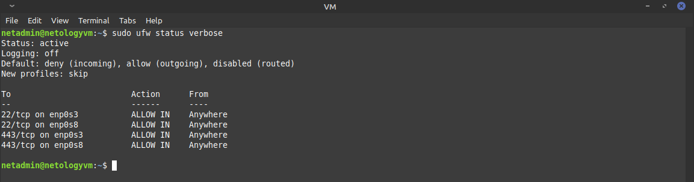

# Курсовая работа по итогам модуля "DevOps и системное администрирование" - Михаил Караханов

## Выполненные работы

1. Создана ВМ `netologyvm` на базе Oracle VirtualBox, установлена OC **Debian 11 (bullseye)**
2. Установка и настройка `ufw`:
    - выполнена установка пакета командой `sudo apt install ufw`
    - ВМ имеет несколько сетевых интерфейсов (lo, NAT и для связности с хостом)

    ```bash
    netadmin@netologyvm:~$ ip -br addr
    lo               UNKNOWN        127.0.0.1/8 ::1/128 
    enp0s3           UP             10.0.2.15/24 fe80::a00:27ff:fe03:386d/64 
    enp0s8           UP             192.168.56.101/24 fe80::a00:27ff:fea8:f000/64 
    ```

    - трафик на интерфейсе lo разрешен правилами, прописанными в файле `/etc/ufw/before.rules`

    ```bash
    # allow all on loopback
    -A ufw-before-input -i lo -j ACCEPT
    -A ufw-before-output -o lo -j ACCEPT
    ```

    - разрешен входящий трафик на порты `22/TCP` и `443/TCP`

    ```bash
    sudo ufw allow in on enp0s3 from any proto tcp to any port 22
    sudo ufw allow in on enp0s8 from any proto tcp to any port 22
    sudo ufw allow in on enp0s3 from any proto tcp to any port 443
    sudo ufw allow in on enp0s8 from any proto tcp to any port 443
    ```

    - `ufw` запущен и активирован командой `sudo ufw enable` \
     \
    *ufw настроен и активирован*
